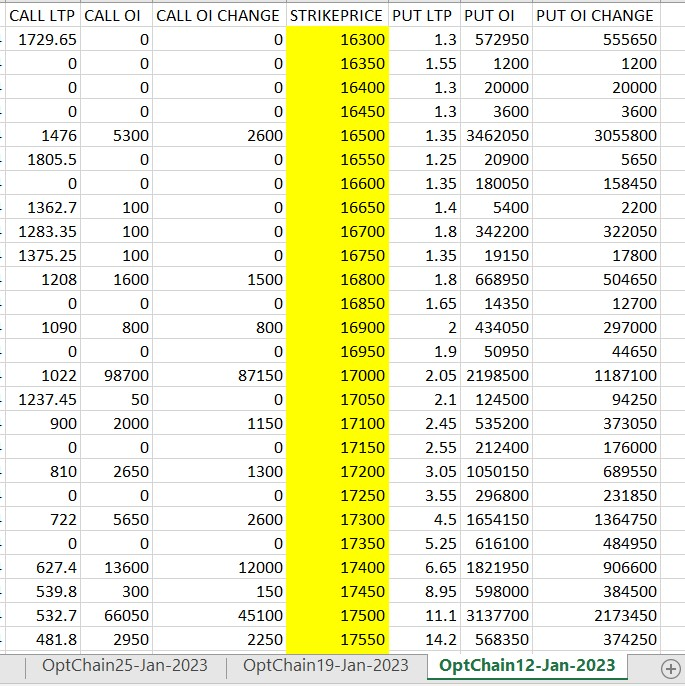

# Getting Option Chain of selected expiries all in single Excel Sheet.

This python script helps in getting Live Optionchain data every 5 mins.
The ATM is calculated based on Futures contract last price. The intrinsic
value as NK sir calls it Chips is caculated as per his youtube video. 
Option chains of multiple expiries can be fetched and configurable using config.json
### 1. Master Sheet

## Install Method
pip install -r requirements.txt

## Contributors
Rahul Gedam
